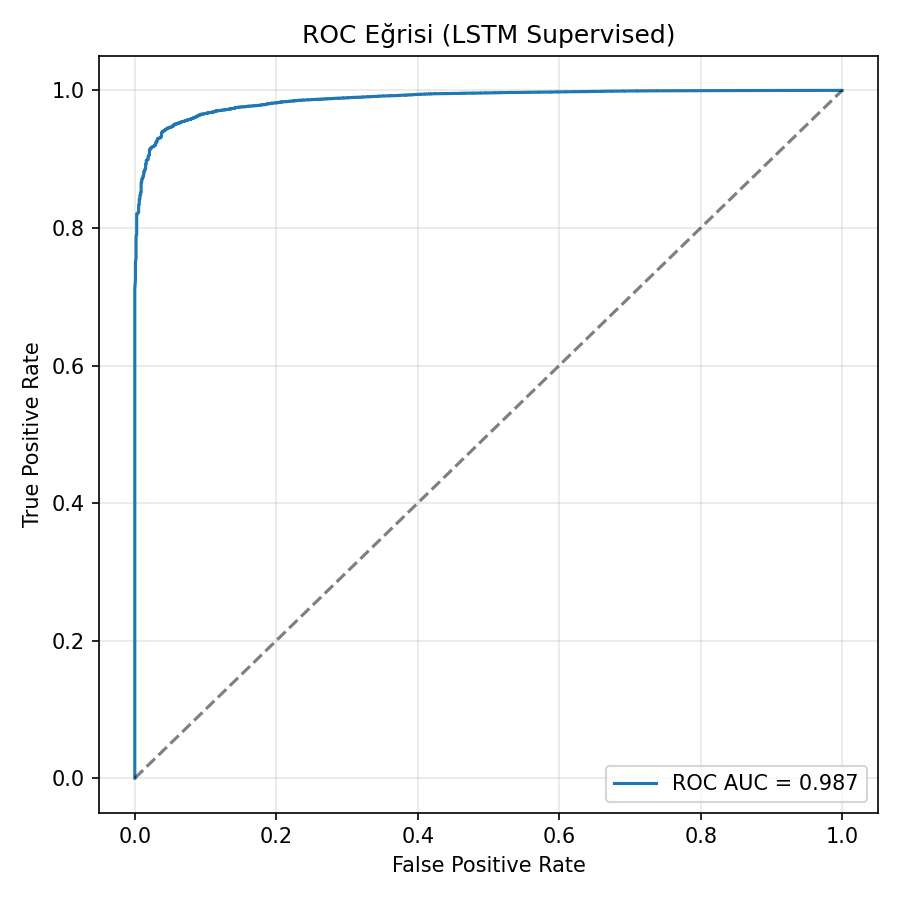
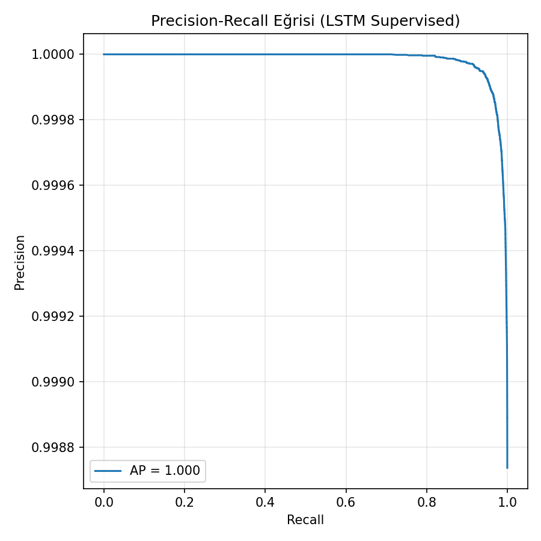
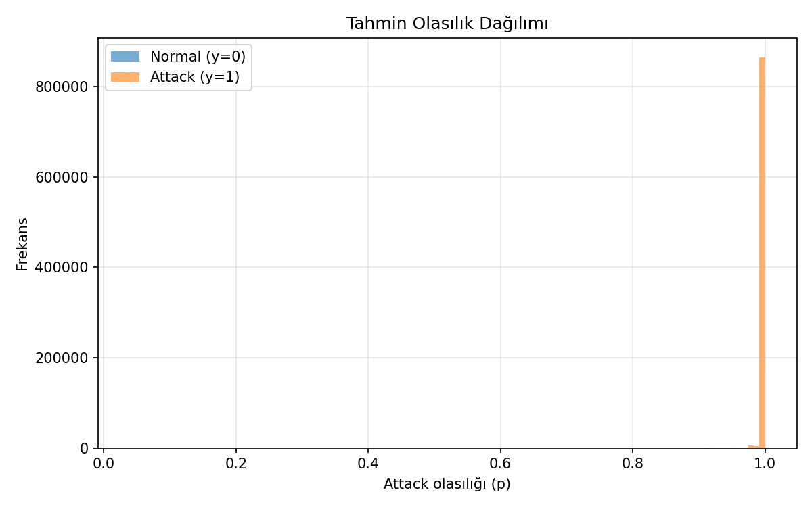

# LSTM Tabanlı Ağ Anomali Tespit Sistemi


---

## Proje Tanımı

Bu proje, **PCAP/PCAPNG** formatındaki ağ trafiği kayıtlarından çıkarılan istatistiksel öznitelikler kullanılarak,
**LSTM (Long Short-Term Memory)** tabanlı **denetimli bir derin öğrenme modeli** ile
ağ anomalilerinin ve saldırı davranışlarının tespit edilmesini amaçlamaktadır.

Sistem hem **çevrimdışı veri setleri üzerinde model değerlendirmesini**
hem de **gerçek zamanlı akan ağ trafiğinde anomali tespiti ve uyarı üretimini** desteklemektedir.

---

## Projenin Amacı

- PCAP tabanlı ağ trafiğinden anlamlı öznitelikler çıkarmak  
- Normal trafik ile saldırı/anomali trafiğini ayırt edebilen bir LSTM modeli eğitmek  
- ROC ve Precision–Recall gibi metriklerle model başarımını ölçmek  
- Gerçek zamanlı ağ trafiğinde anomali tespiti gerçekleştirmek  

---

## Veri Kaynağı

- **Girdi formatları:** `.pcap`, `.pcapng`, `.cap`
- **İkili sınıflandırma:**
  - `0`: Normal trafik  
  - `1`: Saldırı / Anomali trafiği  

Tek PCAP dosyası, klasör veya ayrı **normal / saldırı** klasörleri desteklenmektedir.

---

## Özellik Çıkarımı

Model girişinde **19 adet sayısal özellik** kullanılmaktadır:

- Trafik hacmi ve paket boyutu istatistikleri  
- Protokol dağılımları (TCP, UDP, ICMP)  
- Port davranışı ve Shannon entropisi  
- Zaman tabanlı yoğunluk metrikleri (Packets Per Second)  
- TCP bayrakları (SYN, FIN, RST)  
- IP adresi çeşitliliği  

---

## Veri Ön İşleme

- Sayısal olmayan sütunlar kaldırılmıştır  
- NaN ve sonsuz değerler temizlenmiştir  
- Veriler **MinMaxScaler** ile `[0,1]` aralığında ölçeklenmiştir  
- Opsiyonel olarak **PCA (%95 varyans korunarak)** uygulanmıştır  
- PCA yalnızca **eğitim verisi** üzerinde fit edilmiştir  

---

## Model Mimarisi

- PyTorch tabanlı **LSTM ikili sınıflandırıcı**
- **Girdi şekli:** `(batch_size, sequence_length=10, feature_count)`
- **2 katmanlı LSTM**, gizli katman boyutu: `64`
- **Dropout:** `0.3`
- Çıkış katmanında **sigmoid aktivasyonu**

---

## Zaman Penceresi (Sequence) Mantığı

Model tekil örnekler yerine **10 zaman adımlık pencereler** üzerinde karar verir.

Bir pencere içinde **en az bir saldırı etiketi** bulunuyorsa,
ilgili pencere **saldırı** olarak etiketlenir.

Bu yaklaşım kısa süreli saldırıların daha güvenilir yakalanmasını sağlar.

---

## Performans Değerlendirmesi

Model test veri seti üzerinde **sequence bazlı** olarak değerlendirilmiştir.

### ROC Curve


**ROC AUC:** `0.987`

### Precision–Recall Curve


**Average Precision (AP):** `1.000`

### Prediction Probability Distribution


---

## Gerçek Zamanlı Anomali Tespiti

Gerçek zamanlı senaryoda ağ trafiği **kaydırmalı pencere (buffer)** mekanizması ile tutulur.

Buffer dolduğunda:
- LSTM modeli çalıştırılır  
- Saldırı olasılığı eşik değeri aşarsa **anomali uyarısı** üretilir  

---

## Proje Yapısı

```text
Network_Anomaly_detection/
│
├── assets/
│   └── gif/
│       └── detect.gif
│
├── metrics_plots/
│   ├── roc_curve.png
│   ├── pr_curve.png
│   └── pred_prob_hist.png
│
├── model_torch_supervised/
│   ├── lstm_supervised_torch.pt
│   ├── metadata.pkl
│   ├── pca.pkl
│   └── scaler.pkl
│
├── src/
│   ├── ag_test.py
│   ├── csv_bolme.py
│   ├── DATA_COLLECT.py
│   ├── model_trainer.py
│   ├── pcap_to_csv.py
│   └── real_time_det.py
│
├── README.md
└── requirements.txt


## LSTM-Based Network Anomaly Detection System


### Project Description

This project aims to detect network anomalies and attack behaviors using a supervised LSTM (Long Short-Term Memory)
based deep learning model trained on statistical features extracted from PCAP/PCAPNG network traffic data.

The system supports both offline evaluation on labeled datasets and real-time anomaly detection
on streaming network traffic using a threshold-based alert mechanism.

---

### Project Objectives

- Extract meaningful and discriminative features from PCAP-based network traffic  
- Train an LSTM model capable of distinguishing normal and attack traffic  
- Evaluate model performance using ROC and Precision–Recall metrics  
- Perform real-time network anomaly detection  

---

### Data Source

- Input formats: `.pcap`, `.pcapng`, `.cap`
- Binary classification:
  - `0`: Normal traffic  
  - `1`: Attack / anomalous traffic  

The system supports single PCAP files, directories, or separated normal/attack folders.

---

### Feature Engineering

The model uses a fixed set of 19 numerical features, including:

- Traffic volume and packet size statistics  
- Protocol distribution ratios (TCP, UDP, ICMP)  
- Port behavior and Shannon entropy  
- Time-based intensity metrics (Packets Per Second)  
- TCP flag statistics (SYN, FIN, RST)  
- IP address diversity  

---

### Data Preprocessing

- Non-numeric columns are removed  
- NaN and infinite values are handled  
- Features are scaled to the range [0, 1] using MinMaxScaler  
- Optional PCA is applied to retain 95% of the explained variance  
- PCA is fitted only on training data to prevent data leakage  

---

### Model Architecture

- PyTorch-based LSTM binary classifier  
- Input shape: `(batch_size, sequence_length=10, feature_count)`  
- Two-layer LSTM with hidden size 64  
- Dropout rate: 0.3  
- Sigmoid activation produces attack probability  

---

### Sequence-Based Learning

Instead of single samples, the model makes decisions based on sliding windows of 10 consecutive time steps.
If at least one attack occurs within a window, the entire sequence is labeled as an attack.

This approach improves the detection of short-lived and burst attacks.

---

### Performance Evaluation

The model is evaluated on the test set using sequence-based predictions.

#### ROC Curve


**ROC AUC:** 0.987

#### Precision–Recall Curve


**Average Precision (AP):** 1.000

#### Prediction Probability Distribution


---

### Real-Time Anomaly Detection

In real-time scenarios, network traffic is stored in a sliding window buffer.
Once the buffer is full, the LSTM model predicts the attack probability,
and anomalies are flagged when the probability exceeds a predefined threshold.

---

### Project Structure

```text
Network_Anomaly_detection/
│
├── assets/
│   └── gif/
│       └── detect.gif
│
├── metrics_plots/
│   ├── roc_curve.png
│   ├── pr_curve.png
│   └── pred_prob_hist.png
│
├── model_torch_supervised/
│   ├── lstm_supervised_torch.pt
│   ├── metadata.pkl
│   ├── pca.pkl
│   └── scaler.pkl
│
├── src/
│   ├── ag_test.py
│   ├── csv_bolme.py
│   ├── DATA_COLLECT.py
│   ├── model_trainer.py
│   ├── pcap_to_csv.py
│   └── real_time_det.py
│
├── README.md
└── requirements.txt
